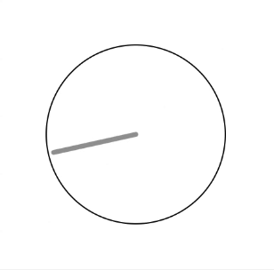
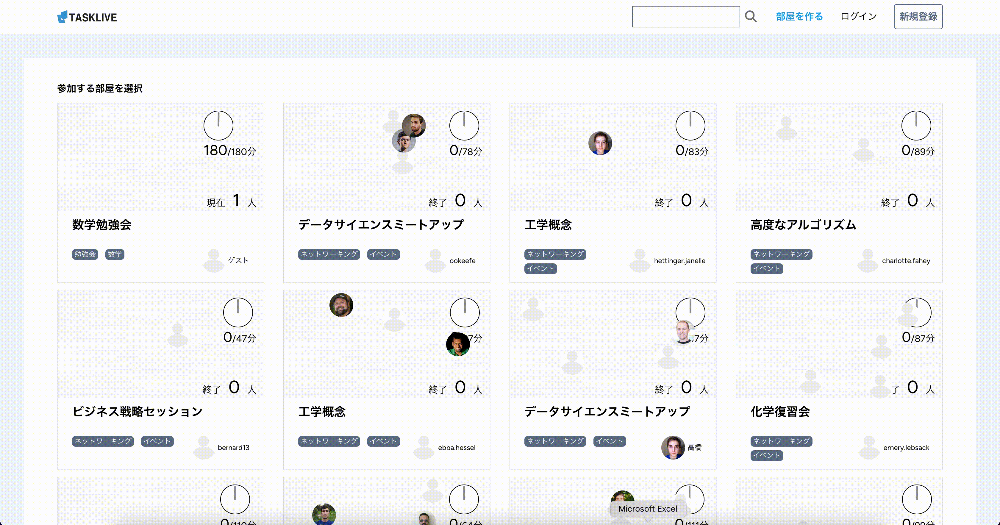

# はじめに
こんにちは！ご訪問いただきありがとうございます！
このREADMEでは、私が開発しているWEBアプリケーション「TASKLIVE」について紹介します。

# アプリの概要


授業で特定の部屋にユーザーが集まり、各々が課題を進めつつ話し合いができるような環境をWEB上で実現することを目指しています。そこで、このアプリは、ユーザーが「部屋」を作成し、共に作業できる機能を提供します。また、リアルタイムで残り時間を表示する機能も備えており、タスク管理に役立つツールです。

### アプリのURL
アカウント登録なしでもご利用いただけます。

https://task-live.com


# 開発背景
私は都内にある大学の建築学生で、建築設計の授業では同じ教室にいる友人と議論しながら設計を進めていました。しかし、大学2年時、コロナ禍に見舞われ自分の部屋で1人で模型の設計を行わなければなりませんでした。

そこで、これまでオフラインで行っていた友人と同じ空間で議論し合いながら作業を進めるような環境をオンライン上でも実現したいと考えました。こうして、オンライン上にて同じ教室内で友人と作業を行っているような環境を目指した**TASKLIVE**の開発を進めました。

**TASKLIVE**は、ユーザーが仮想の「部屋」を作成し、そこで他のユーザーと共に作業を進めることができます。また、部屋には授業のように制限時間を設けて残り時間を表示する機能も備え、制限時間を迎えた後は作業の進捗状況を整理することができます。

以降では、大学2年時に開発した**TASKLIVE**について整理しました。その後、最新の技術を学ぶために、このアプリを最新の技術を用いてリプレイスを行いましたのでその内容についても記載します。

# 開発内容
## 環境

| 種類 | 技術名 |
|:-:|:-:|
|  フロントエンド |  React（^18.2.0）,TypeScript（^5.0.2）,Tailwind CSS（^3.2.1）,Inertia.js（^1.0.16） |
|  サーバーサイド |  Laravel（^11.0）, Inertia.js(^1.0）|
|  データベース |  MySQL(^5.7）|
|  ランタイム |  Node.js(^16.20.2）|
| ホスティング  |  Xserver |
|  バージョン管理 |  GitHub |


## ER図


## アプリの内容
### 部屋の参加
トップページでは、部屋一覧を閲覧できます。


特定の部屋を選択すると、部屋に参加できます。


チャットのようにコメントが可能でコミュニケーションをとりつつタスクを行えます。


### 完了タスクの記録
制限時間になると、完了タスクの入力が可能です。


入力した内容はマイページで閲覧することが可能です。


### 部屋の検索
ヘッダーにあるフォーム、または各部屋に設定されているタグから部屋を絞り込むことができます。


# 苦労や反省した点

**・時計の針のカクツキ**



実際のカクツキの様子は録画を失念しており上記はあくまでイメージになってしまいますが、針は進んでいる一方で針が進むごとにその位置から前後に振動しているような挙動でした。

原因は、useStateで管理していた残り時間が毎秒更新されるたびに、レンダリングが実施されたためでした。

そこで、制限時間はuseEffectで初期状態のみ管理し、あとはCSSのアニメーションによって針を回転させるようにすることで改善しました。


**・別ページで適用したスタイルが次のページにも適用される**<br>
時計のスタイルはTailwind CSSで管理するにはやや複雑であり今後独自のUIに変える予定であるため、CSSファイルで管理し切り分けています。
デフォルトのスタイルに関するCSSファイルはClockコンポーネント内で読み込ませており、
詳細ページではデフォルトのサイズよりも大きくしたかっため別のCSSファイルを読み込ませていました。
しかし、詳細ページからTOPページに遷ると以下のように前のページのスタイルが残ったままでした。


原因は、本アプリケーションをSPAとして構築しているため、ページ遷移後も一度インポートしたCSSファイルが削除されず、そのまま読み込まれていました。

そこで、ページ独自のスタイルの読み込みはCSS Modulesを利用することでCSSのスコープがコンポーネント単位に限定し、他のページやコンポーネントに影響を与えないようにすることで改善しました。


**・本番環境で動かない**<br>
今回は利用する技術を可能な限り全て最新版を使用しており、本番環境にアップロードしたところ以下のようなエラーが発生しました。

    node: /lib64/libm.so.6: version `GLIBC_2.27' not found (required by node)

GLIBCという基本的なシステムライブラリが原因で、最新のNode.jsバージョンが本番環境で動作しないことがわかりました。

GLIBCのバージョンを変更することは、技術的にも運用的にもリスクが高く、共有ホスティング環境では実質的に不可能であるとのことでした。今回は、比較的簡単であるNode.jsのバージョンをダウングレードすることで対応しました。

当然ではありますが、改めて**本番環境で実現できる環境とローカル環境で実現できる環境を事前に調査して合わせる必要がある**ことが身に染みて分かりました。


**・ページトランジション実装にあたる拡張性の考慮**<br>
ページトランジションとは、ページ遷移する際にフワッと表示されるアニメーションです。




ページトランジションを全てのページに実装する際、拡張性を考慮することに苦労しました。当初は、ルートコンポーネントにページトランジションを設定し、すべてのページに適用するつもりでしたが、ルートコンポーネントはアプリケーション全体のエントリーポイントとして一度だけレンダリングされるため、ページ遷移ごとにアニメーションが発火せず、各ページコンポーネントの切り替え時にアニメーションが発火することを期待している場合には不適切であると考えました。
```    
// app.tsx （ルートコンポーネントをページトランジション用のコンポーネントでラップしたコード)
<React.StrictMode>
    <PageTransition>
        <App {...props} />
    </PageTransition>
</React.StrictMode>
```


そこで、課題を解決し拡張性を確保するために、共通のレイアウトやスタイルを複数のページで再利用できるレイアウトコンポーネントにページトランジションを含めるアプローチを採用しました。この方法で、一貫したユーザーエクスペリエンスを提供しつつ、各ページの状態管理が簡素化され、拡張性と再利用性が向上させることを目指しました。

```    
// Top.tsxなど （ページコンポーネントにレイアウトコンポーネントを用いたコード）
import BaseLayout from '@/Layouts/BaseLayout.tsx'
<BaseLayout>
    {/* ページの内容 */}
</BaseLayout>


// BaseLayout.tsx （レイアウトコンポーネント内にページトランジションを実装したコード）
<div>
    <header></header>
    <main>
        <PageTransition>
            {children}
        </PageTransition>
    </main>
    <footer></footer>
</div>
```


# 今後の展望
**・リアルタイム更新の導入**<br>
現状チャットの内容や参加人数は一定時間ごとに取得し、表示させています。しかし、この方法ではパフォーマンスに問題が発生する可能性があります。特に、ユーザーが増加したり、チャットが活発化したりする場合、サーバーへのリクエストが頻繁に発生し、応答時間の遅延やサーバー負荷の増加が懸念されます。
そこでWebSocketやPusherなどのリアルタイム技術を導入することで、サーバーからのプッシュ通知を利用し、チャット内容や参加人数をリアルタイムで更新します。これにより、サーバーへの負荷を分散し、全体的なパフォーマンスを向上させたいと考えています。


# 最新技術を使ってみた感想
これまではVue、Bootstrapをメインに用いていましたが今回はInertia.js、React、TypeScript、やTailwind CSSを取り入れてみました。
（最新技術というよりも流行りの技術という方が正確かも知れません。）

**・Inertia.js**<br>
今回はSPAに近い形で構築しましたが、Inertia.jsを利用することでルーティングや認証をLaravelに一任でき、開発効率の向上を感じました。

**・React**<br>
Vueと比較して大規模開発に向いていると言われている理由が少し理解できたように感じました。Vueでは状態管理や関数に関係するコードの記述箇所が指定されていますが、Reactでは記述箇所が自由で、バインディングも単一方向であるため、開発者の裁量に任されている部分が多いことが分かりました。

**・TypeScript**<br>
TypeScriptに関する記事を見ると大規模開発向けであるとよくみていたので、JavaScriptの使用は個人開発であったこともあり型付けは必要ないと思っていました。
今まではエラーが発生するたびに、デバッグのためにコンソールに出力して内容を確認し修正することを繰り返していましたが、エディタでコードを書いている時点である程度不具合が解消され、生産性が上がったことを実感できたように思います。

**・Tailwind CSS**<br>
Bootstrapではカードなどの特定のUIが既に作成されていたことで開発スピードがとても速く気に入っていましたが、Tailwindでは細かい調整ができてこちらの方が好みでした。
Bootstrapであるとスタイルの適用が!important宣言されており詳細度を無視され、その部分のスタイルを調整したい場合は!importantを適用していましたが強引なやり方であると感じていました。今後はひとまずTailwind CSSを用いてみようと思います。

# まとめ

今回の開発では、最新技術を取り入れることで多くの学びがありました。特に、Inertia.jsやReact、TypeScript、Tailwind CSSの導入により、開発プロセスの効率化やユーザー体験の向上が図れたことは大きな収穫でした。一方で、Laravel 11の活用については、まだ十分に使いこなせていない部分もあり、今後さらに理解を深めていく必要があると感じています。

大枠が完成しましたが、まだまだ理想としていたアプリケーションではないため引き続き機能の改善と拡充を図っていく予定です。特に、リアルタイム通信やパフォーマンスの最適化については、引き続き注力していきます。

また、建築学生の建築設計に関する議論をオンラインで行う場合ZOOM等の画面共有アプリを用いたとしても伝わらないことがあるように感じます。今回の開発の過程で学び感じたことを活かし、このTASKLIVEを拡張し新たなアプリケーションを作成していきます。